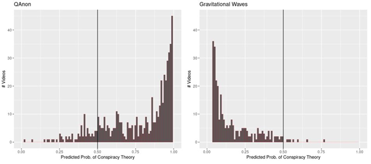
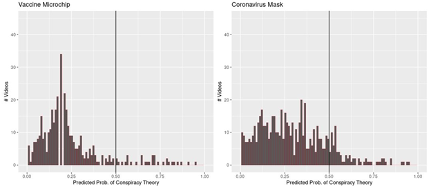
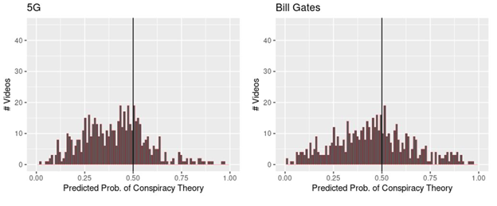
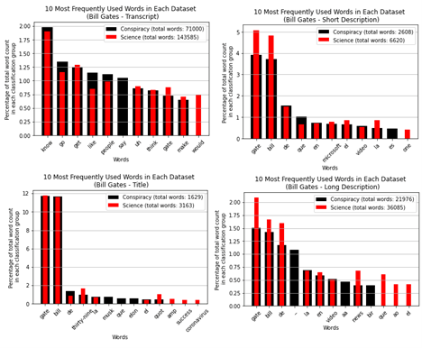
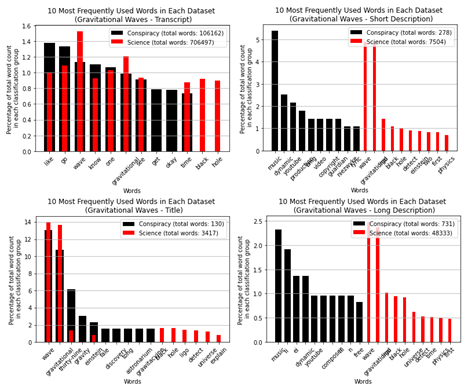
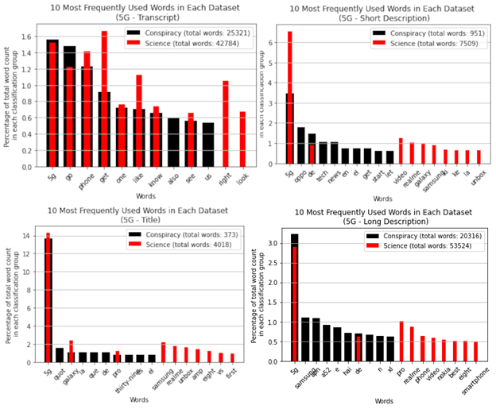
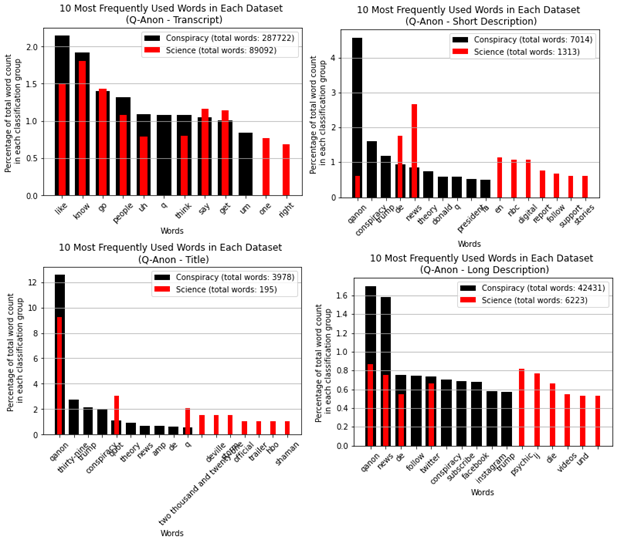
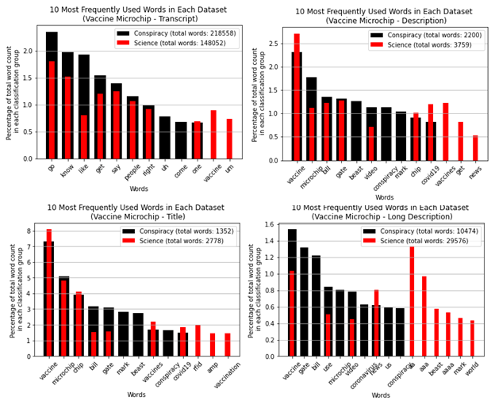
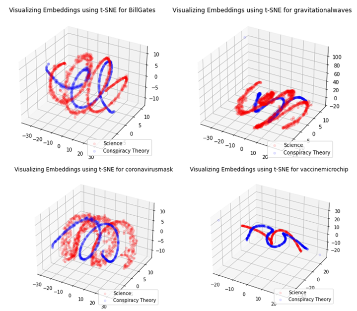

Youtube Classification with Zero-Shot Analysis
================

- [Introduction](#introduction)
- [Required Packages](#required-packages)
- [Importing Data from YoutubeAPI](#importing-data-from-youtubeapi)
  - [Make_CSV() Function](#make\_csv-function)
  - [Get_CC() Function](#get\_cc-function)
  - [Get_LongDesc() Function](#get\_longdesc-function) 
- [Fitting the Model](#fitting-the-model)
  - [ZS_Classify() Function](#zs\_classify-function)
- [Cleaning the Video Data](#cleaning-the-video-data)
- [Results](#results)
- [Discussion](#discussion)
- [Potention Directions for Future Work](#potention-directions-for-future-work)
- [References](#references)

# Introduction

The growth of video platforms such as YouTube has created an outlet for educators and content creators to express their unfiltered views to millions of users at the click of a button. In recent years, this growth has also given rise to conspiracy theorists, many of whom have developed significant followings. Without any available filters to determine the quality of a particular video, the onus of deciphering fact from fiction is put on the end-user. Out of this pitfall arises the question: can statistical methods be used to automatically rank the videos from a particular search based on some measurable quality?

The motivation for this project is a continuation of a studyA from fall 2020 by Dr. John Muth, Jimmy Hickey, Russell Sui, Yiming Wang, and David Elsheimer. In this work, the consultants attempted to derive the quality of YouTube videos based on the video’s comments. This project seeks to expand that project using natural language processing (NLP) to analyze the videos’ keywords, descriptions, and closed caption transcripts. To do this, we will posit a machine learning model to categorize the videos from a particular search.

A machine learning approach would utilize one of two basic frameworks: supervised learning or unsupervised learning. In supervised learning, a known truth would be used to categorize our data in order to create a training set. When comparing reality to conspiracy theory, this sounds like a simple task. However, truth can often be subjective, and our own inherent biases could influence the model’s classification. On the other hand, unsupervised learning uses no such class labels and instead infers natural structures that exist within the data set. In this respect, unsupervised learning is more tailored to this project’s goals.
The particular unsupervised method we will explore is zero-shot learningB. Zero-shot learning performs categorization without the need for a training set or class definitions. Instead, the user states a set of candidate labels, which the model compares to the input vector of text. The model then associates a probability with each label, based on the degree to which the input text linguistically entails the candidate labels. The label corresponding to the highest predicted probability of entailment is the predicted class.

Our end goal is to create a model that will rank the informational quality of YouTube videos from a particular search. A particular drawback of this project is that it may prove challenging to generalize to less divisive searches. Topics such as ‘5G’ or ‘Covid-19’ have ample conspiracy theories surrounding them, many of which are characterized by unique buzzwords or phrases. As a result, machine learning methods based on NLP may produce very distinct groupings, for example, those based on science and those based on conspiracy theory. A future direction for this project might be to optimize this model to rank quality for less polarized topics

# Required Packages
```python
import numpy as np
import os
import csv
import json
import requests
import re
import pandas
import nltk
from youtube_transcript_api import YouTubeTranscriptApi
from transformers import pipeline
```

# Importing Data from YoutubeAPI

## Make_CSV() function
```python
make_csv(my_keyword, youtube_api_key)
```

The `Make_CSV` function pulls data from the YoutubeAPI and outputs it to a 
CSV file. It takes on two arguments:

  - `my_keyword`: Must be passed as a string. This is the search term or 
    phrase that will be passed on the API.
  - `youtube_api_key`: Must be passed as a string. See 
    https://developers.google.com/youtube/v3/quickstart/python for instructions 
    on obtaining an API key.

## Get_CC() function
```python
get_cc(my_keyword)
```

The `Get_CC` function takes the outputted CSV from the `Make_CSV()` function 
and uses it to pass a list of `VideoID`'s and obtain their closed-captioning 
information from the YoutubeTranscriptAPI. It takes on a single argument:

  - `my_keyword`: Must be passed as a string. This is the same keyword that was 
    used to produce the CSV in `Make_CSV`. It is used to point the function to the 
    CSV file created by that function. 

## Get_LongDesc() function
```python
get_longdesc(my_keyword)
```

The `Get_LongDesc` function takes the outputted CSV from `Make_CSV()` function and 
uses it to pass a list of `VideoID`'s and obtain their long description information 
from the YoutubeAPI. It takes on a single argument:

  - `my_keyword`: Must be passed as a string. This is the same keyword that was 
    used to produce the CSV in `Make_CSV`. It is used to point the function to the 
    CSV file created by that function. 

# Fitting the Model

## ZS_Classify() function
```python
zs_classify(textVec, candidate_labels)
```

The `zs_classify` function takes a column of data from a pandas dataframe and 
candidate labels for classification and fits the data to a zero-shot model. It 
takes on two arguments:

  - `textVec`: Takes on a column from the pandas dataframe created from data 
    retrieved during the `Make_CSV()` data pull (ex. `df['LongDescription']`). 
  - `candidate_labels`: Takes on a sorted list of potential candidate labels. 
    In our case, to classify to 'science' or 'conspiracy', we would pass 
    `['science','conspiracy']`.

# Cleaning the Video Data

## Custom_Tokenize() function
```python
custom_tokenize(text)
```

The `custom_tokenize` function is a wrapper for the `word_tokenize()` function 
from the `NLTK` library that first changes `NA` values to blank strings before 
tokenizing the rows of the dataframe. It takes on a single argument:

  - `text`: Takes on a column from a pandas dataframe consisting of information 
    relating to a particular `VideoID` (ex. keywords, long description, etc.).

## Lemmatize_Sentence() function
```python
lemmatize_sentence(tokens)
```
The `lemmatize_sentence` function first adds a part-of-speech tag. It then takes 
the tokenized words (output from `custom_tokenize()`) and their associated parts 
of speech and applies the `lemmatize()` function from `NLTK`. This reduces different 
forms of a word to its lemma for better frequency analysis. For example, 'built', 
'building', and 'builds', when all categorized as verbs will be changed to their 
lemma, 'build'. It takes on a single argument:

  - `tokens`: Takes on the pandas dataframe column of tokenized words outputted by 
    the `custom_tokenize()` function.

# Results

Here, we present the results of the ZS data pipeline applied to YouTube keywords ‘QAnon’, ‘Gravitational Waves’, ‘Vaccine Microchip’, ‘Coronavirus Mask’, ‘5G’, and ‘Bill Gates’.  We classified the resulting videos as either ‘science’ or ‘conspiracy theory’ based on the videos’ long description. On the left in Figure 1, we have a histogram of the predicted probabilities for the videos resulting from the QAnon search. The mass to the right of the vertical line represents the proportion of videos classified as conspiracy theory.

<!-- -->

*Figure 1. The predicted probability of videos from the ‘Q-Anon’ and ‘Gravitational Waves’ searches classified as conspiracy theory.*
                                     
For the QAnon search 83.7% (489/584) of the videos were classified as conspiracy theory, and the rest as science. The histogram on the right represents the same information for the gravitational waves search. In this case, only 1.2% (7/576) of the videos were classified as conspiracy theory. These two topics had the most skewed distributions of all the topics searched.

<!-- -->

*Figure 2. The predicted probability of videos from the ‘Vaccine Microchip’ and ‘Coronavirus Mask’ searches classified as conspiracy theory.*

For the vaccine microchip search, 22.2% (122/550) videos and 13.6% (82/603) of the coronavirus mask searches resulted in a classification of conspiracy theory. Figure 2 visualizes this information.

<!-- -->

*Figure 3. The predicted probability of videos from the ‘5G’ and ‘Bill Gates’ searches classified as conspiracy theory.*

As seen in Figure 3, the 5G and Bill Gates searches resulted in 28.4% (161/567) and 40.0% (218/574) of videos classified as conspiracy theory. 

<!-- -->

*Figure 4. The ten most common words from each classification group for the search ‘Bill Gates’.*

In Figure 4, we see the 10 most common words from each classification group for the search term ‘Bill Gates’. The four plots are split based on how the videos were classified: transcript, title, short description, or long description. The black bar represents the top ten words from the ‘conspiracy’ classification and the red bar represents the top ten words from the ‘science’ classification.

<!-- -->

*Figure 5. The ten most common words from each classification group for the search ‘Gravitational Waves’.*

In Figure 5, we see the 10 most common words from each classification group for the search term ‘gravitational waves’. The four plots are split based on how the videos were classified: transcript, title, short description, or long description. The black bar represents the top ten words from the ‘conspiracy’ classification and the red bar represents the top ten words from the ‘science’ classification.

<!-- -->

*Figure 6. The ten most common words from each classification group for the search ‘5G’.*

In Figure 6, we see the 10 most common words from each classification group for the search term ‘5G’. The four plots are split based on how the videos were classified: transcript, title, short description, or long description. The black bar represents the top ten words from the ‘conspiracy’ classification and the red bar represents the top ten words from the ‘science’ classification.

<!-- -->

*Figure 7. The ten most common words from each classification group for the search ‘Q-Anon’.*

In Figure 7, we see the 10 most common words from each classification group for the search term ‘Q-Anon’. The four plots are split based on how the videos were classified: transcript, title, short description, or long description. The black bar represents the top ten words from the ‘conspiracy’ classification and the red bar represents the top ten words from the ‘science’ classification.

<!-- -->

*Figure 8. The ten most common words from each classification group for the search ‘Vaccine Microchip’.*

In Figure 8, we see the 10 most common words from each classification group for the search term ‘vaccine microchip’. The four plots are split based on how the videos were classified: transcript, title, short description, or long description. The black bar represents the top ten words from the ‘conspiracy’ classification and the red bar represents the top ten words from the ‘science’ classification.

We also created plots to visualize the separability of the long description text of videos that were classified as science and conspiracy theory by the ZSL algorithm. To achieve this, after classifying the videos, we concatenated the predicted labels to our original dataset and then split the dataset based on these classifications. From here, we computed the Word2Vec embeddings of the long description data for each of these two datasets, one corresponding to science predictions and the other to conspiracy theory predictions. In these Word2Vec embeddings, each word is encoded as a vector of length 300. For plotting, we reduced the dimensionality of these to 3 dimensions. This plotting technique is known as t-SNE, t-distributed stochastic neighbor embedding. The code to perform this method was acquired from a blog post by Sergey Smetanin on towardsdatascience.comG. Though visually interesting, the plots are not highly interpretable and were similar for each topic. For this reason, only a sample of the plots is included here. The results are given in Figure 9.

<!-- -->

*Figure 9. t-SNE plots of classification results for Bill Gates, Gravitational Waves, Vaccine Microchip, and Coronavirus mask. The word embeddings represented by red dots correspond to text from the long descriptions of videos classified as science and blue from those classified as conspiracy theory.*

# Discussion

The histograms given in Figures 1-3 offer a graphical representation of the proportion of videos from each keyword search that were classified as science and conspiracy theory. The y-axis represents the number of videos, and the x-axis the predicted probability of conspiracy theory. The vertical line is placed at the predicted probability of 0.5, so the mass to the right of this line represents the proportion of videos classified as conspiracy theory for each topic. 

QAnon was selected as a topic on our assumption that this search would result in a large proportion of videos related to conspiracy theories. ZSL labeled 83.7% of the QAnon videos as conspiracy theory. While this is no confirmation of accuracy, it is reassuring to see that these results aligned with our intuition. The results for the gravitational waves videos provide a similar assurance, but in this case, we chose this keyword based on our thoughts that these videos should consist majorly of science rather than conspiracy theory. Since 98.8% of these videos were classified as science, this provides another intuitive confirmation that ZSL is making reasonable predictions. The remaining four keywords were selected with the expectation of polarized results. The most polarizing topic was Bill Gates, which resulted in 40% of predictions corresponding to conspiracy theory. The distribution here is unimodal and nearly symmetric. A closer inspection of videos that had predicted probability near 50% is required here. The other three topics, Vaccine Microchip, Coronavirus mask, and 5G, all resulted in a large majority of predictions of science. It is notable that all of these predictions are based on the videos’ long descriptions. Given more time, we would perform the same classification based on the closed caption data and compare the predictions in each case.

The frequency analysis resulted in interesting findings in very select cases. In figure 8, we see “mark” and “beast” as top words from videos classified to conspiracy by title. This suggests that these words might be important in classifying videos to the conspiracy category. More generally, it appears that classification of shorter form classifiers - like ‘title’ and ‘short description’ appear to show more meaningful results. This could possibly be due to shorter text requirements resulting in users being more selective in what words they use.

For longer form classifiers like long descriptions and transcripts, we see less clear information. In figure 7, we see similar words in both classification groups for the transcript classifier. This pattern repeats in figures 4, 5, 6, and 8. This is likely due to words like “uhm” or “like” occurring at a much higher rate than in shorter form classification methods. These words were not removed by the script in the data cleaning process because they are unique and are not stop-words, however it results in considerable noise that limits our interpretation of these graphs.

Another issue that was seen in the frequency analysis was foreign languages, as can be seen in the ‘title’ and ‘short description’ sections of figure 6. The Spanish words “el”, “la”, and “que”, despite being stop-words, are not removed by the script, which only recognizes English stop-words.

The word embedding plots seem to show pronounced separability between the videos classified and conspiracy theory and science. The static nature of the graphs makes it difficult to see where the data corresponding to each label overlap. As mentioned before, these plots are not highly interpretable. Still, the fact that there is pronounced visual separability for the two categories instills some support for the ability of ZSL to classify the videos based on the long description data accurately.

# Potential Directions for Future Work

Looking forward, these preliminary results using zero-shot learning, frequency analysis, and dimensional reduction can serve as starting points for future direction. The complexity of YouTube metadata when considered for NLP purposes is significant. Foreign languages would need to be addressed by either trying to anticipate and remove foreign language stop words, or try to remove foreign language videos altogether. To better understand which words might be important as well as limit some of the noise seen in many graphs, we would perform frequency analysis using n-grams. N-grams look at the frequency of ‘n’ number of words next to each other in the text. By doing this, we would look at the frequency of certain phrases and potentially glean some phrases that are useful in the classification of videos. We also anticipate that rather than zero-shot classification some experimentation with curated data sets where videos have been classified by hand would be useful. This would be a time intensive task, but perhaps could be obtained via crowdsourcing opinions on videos for certain types of topics.

# References

Muth. J, Hickey J., Sui R., Wang Y., E. David (2020). YouTube Search Results Project

Yin, Wenpeng et al. “Benchmarking Zero-shot Text Classification: Datasets, Evaluation and Entailment Approach.” ArXiv abs/1909.00161 (2019): n. pag.

Depoix, J. (2020). Youtube-transcript-api. GitHub Repository. https://github.com/jdepoix/youtube-transcript-api 

Wolf, T., Debut, L., Sanh, V., Chaumond, J., Delangue, C., Moi, A., Cistac, P., Rault, T., Louf, R., Funtowicz, M., Davison, J., Shleifer, S., von Platen, P., Ma, C., Jernite, Y., Plu, J., Xu, C., Le Scao, T., Gugger, S., Drame, M., Lhoest, Q., & Rush. A.. (2020). HuggingFace's Transformers: State-of-the-art Natural Language Processing. 

Abadi, M., Barham, P., Chen, J., Chen, Z., Davis, A., Dean, J., Devin, M., Ghemawat, S., Irving, G., Isard, M. & others (2016). TensorFlow: A System for Large-Scale Machine Learning.. OSDI (p./pp. 265--283). 

Davidson, J. (2020) Zero-shot Learning in Modern NLP.
    https://joeddav.github.io/blog/2020/05/29/ZSL.html

Smetanin, S. (2018). Google News and Leo Tolstoy: Visualizing Word2Vec Word Embeddings using t-SNE. https://towardsdatascience.com/google-news-and-leo-tolstoy-visualizing-word2vec-word-embeddings-with-t-sne-11558d8bd4d
